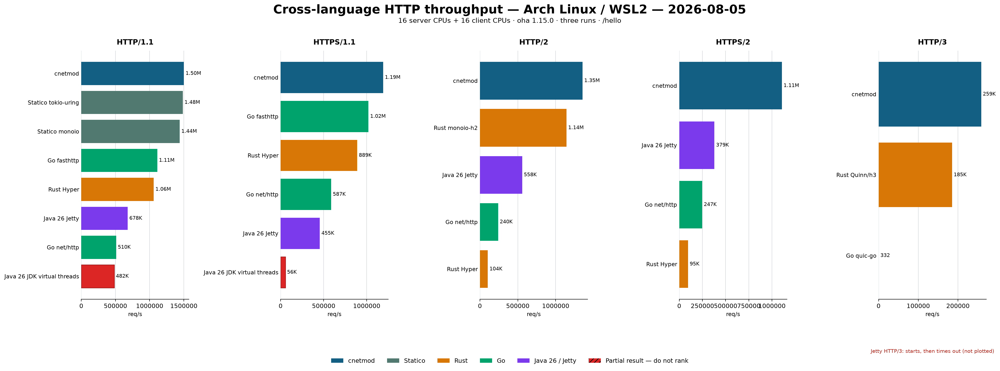

# cnetmod

Production-oriented C++23 asynchronous networking infrastructure built on native coroutines and platform-native I/O backends.

> In the age of AI-assisted programming, architectural maturity has leveled the differences in development difficulty; performance and efficiency are the only decisive benchmarks.

[](https://github.com/banderzhm/cnetmod/actions/workflows/linux-clang.yml)
[](https://github.com/banderzhm/cnetmod/actions/workflows/macos-clang.yml)
[](https://github.com/banderzhm/cnetmod/actions/workflows/windows-msvc.yml)

English | [简体中文](README_zh.md)

## Platform Support

| Platform | I/O Engine | Compiler | Status |
|----------|-----------|----------|--------|
| Windows | IOCP | Latest Visual Studio 2026 (MSVC) | ✅ |
| Linux | io_uring + epoll | clang-21 + libc++ | ✅ |
| macOS | kqueue | clang-21 + libc++ | ✅ |

### AI Development Skills

The [`skill/`](skill/) directory contains the project-specific instructions for AI-assisted development. AI agents should read [`skill/SKILL.md`](skill/SKILL.md) first, then consult the topic-specific guidance under `skill/core`, `skill/coro`, `skill/database`, `skill/http`, `skill/infra`, `skill/protocols`, and `skill/security` as needed.

### Engineering Evidence

- **Architecture**: C++23 module interfaces with platform-specific implementations selected by CMake; native IOCP, io_uring, epoll, and kqueue backends share the same coroutine-facing APIs.
- **Verification**: GitHub Actions builds target Linux, macOS, and Windows configurations. The repository includes unit, protocol interoperability, benchmark, chaos, and restart-recovery test paths.
- **Reproducibility**: Performance sections identify hardware, compiler, backend, workload, and concurrency parameters, and point to local benchmark targets for verification.
- **Operational behavior**: Protocol clients and brokers include reconnect, retry, flow-control, persistence, TLS/mTLS, and recovery mechanisms where applicable; asynchronous APIs use structured results and error codes.

## Features

### Core Runtime
- **Coroutine engine**: `task<T>`, `spawn()` fire-and-forget, symmetric transfer for tail-call optimization
- **I/O context**: Platform-native event loop (IOCP / io_uring / epoll / kqueue) with thread-safe `post()`
- **Multi-core**: `server_context` with dedicated accept thread + N worker `io_context` threads + stdexec thread pool
- **stdexec integration**: `schedule()` sender, `async_scope`, `blocking_invoke()` for offloading blocking calls

### Networking
- **TCP**: Async accept / connect / read / write with RAII socket wrappers
- **UDP**: Async sendto / recvfrom
- **TLS/SSL**: OpenSSL-backed `ssl_context` / `ssl_stream` with async handshake, SNI, client certificate support
- **Async DNS**: `async_resolve()` — non-blocking DNS via stdexec thread pool + `getaddrinfo`
- **Serial port**: Cross-platform async serial I/O

### Protocols
- **HTTP/1.1 & HTTP/2**: Full server with router, middleware pipeline, chunked transfer, multipart upload; HTTP/2 via TLS + ALPN negotiation with multiplexed streams
- **WebSocket**: Server-side upgrade from HTTP, frame codec, ping/pong, per-message deflate
- **SOCKS5**: Proxy protocol client and server — CONNECT, BIND, UDP ASSOCIATE commands; authentication methods (no auth, username/password, RFC 1961 GSSAPI provider callbacks); IPv4, IPv6, and domain name support
- **MQTT v3.1.1 / v5.0**: Full broker + async client — QoS 0/1/2, retained messages, will, session resume, shared subscriptions, topic alias, auto-reconnect; sync client wrapper
- **Kafka**: Async producer and consumer groups — metadata discovery, API-version negotiation, record batches, gzip/LZ4 compression, idempotent and transactional production, cooperative-sticky rebalancing, manual offset commits, SASL/TLS, retry and reconnect handling
- **AMQP 0-9-1**: RabbitMQ-compatible async client — channels, durable exchanges/queues/bindings, publisher confirms, QoS/prefetch, ACK/NACK, transactions, heartbeats, automatic reconnection and topology recovery, SASL/TLS
- **AMQP 1.0**: Artemis-compatible async client — SASL/TLS connections, sessions, sender/receiver links, credit-based flow control, unsettled delivery outcomes, explicit settlement, transactions, reconnect and link recovery
- **MySQL**: Async client with prepared statements, connection pool, pipeline, transaction management, ORM (CRUD / migration / query builder / MyBatis-Plus style XML mappers / BaseMapper / pagination / soft delete / optimistic lock / multi-tenant / cache)
- **PostgreSQL**: Async TLS client with SCRAM-SHA-256/MD5 authentication, prepared queries, cancellation, and seamless reuse of the MySQL ORM model/query/session API
- **MongoDB**: Async BSON/OP_MSG client with TLS, SCRAM-SHA-256, capability negotiation, strict protocol limits, and correlated command execution
- **Redis**: Async client with RESP protocol, connection pool
- **Raft**: Replicated state machine toolkit with leader election, log replication, ReadIndex, leader lease / check-quorum, joint consensus membership changes, snapshot install / compaction, LevelDB-backed persistence, TCP transport, TLS / mTLS authentication, transport metrics, chaos / restart tests, and distributed storage examples
- **Modbus**: Complete protocol implementation — TCP/UDP/RTU (serial) client and server, all standard function codes, connection pool, CRC-16 validation, frame timing control, data stores (mutex-based and lock-free channel-based)
- **CoAP**: CoAP for constrained devices — RFC 7252 message/option codec, confirmable request retransmission, Observe subscriptions/notifications, token/message-id matching, resource router, Block1/Block2 helpers, CoAPS/DTLS context support
- **OpenAI**: Async API client (chat completions, etc.)

### Raft Performance
Release benchmark on Intel Core i9-14900K:

| Scenario | Throughput |
|----------|------------|
| Single-node append + commit | ~5.17M - 5.50M ops/s |
| 5-node majority replication | ~0.80M - 0.83M ops/s |

Use `testing/bench/bench_raft.cpp` for reproducible local measurements. Actual results depend on compiler, allocator, storage backend, CPU frequency policy, and network / loopback environment.

Full guide: [Raft](docs/en/protocols/raft.md). Embedding guide for host projects
with overlapping dependencies: [Third-party Dependency Integration](docs/en/advanced/thirdparty-dependency-integration.md).

### Cross-language HTTP Performance

The reproducible runner in [testing/bench/crosslang](testing/bench/crosslang)
covers cnetmod and Rust together with Go 1.26 (`net/http`, `fasthttp`,
`quic-go`) and Java 26 (JDK virtual threads and Jetty). On Arch Linux/WSL2 with
Go 1.26.5 and OpenJDK 26.0.2, the Go HTTP/1.1, h2c, HTTPS/2, and HTTP/3 smoke
paths passed; Java virtual-thread HTTP/1.1/TLS and Jetty HTTP/1.1, h2c, and
HTTPS/2 passed. Jetty 12.1.11 HTTP/3 starts but times out with the local curl
HTTP/3 client, so it is intentionally excluded from the default measured set
and has no published throughput claim. See the runner README for commands,
environment capture, and the experimental diagnosis command.

This is the directly comparable full run: cnetmod, Rust, Statico, Go, and Java
share the pinned 16-server-CPU / 16-client-CPU layout, `oha 1.15.0`, three runs,
and the `/hello` response. Red rows are incomplete results and must not be used
as throughput rankings. In particular, JDK virtual threads reached only 99.34%
for HTTP/1.1 and 90.29% for HTTPS/1.1; Jetty HTTP/3 starts but times out, so it
does not appear as a measured HTTP/3 row.



Raw JSON, the machine environment, and the generated CSV/Markdown summary are
kept in `testing/bench/results/crosslang/2026-08-05-arch-go-java26`.

Arch Linux under WSL2, Release build, Intel Core i9-14900K, Clang 22.1.8,
Linux 6.18, io_uring, mimalloc, and local loopback. Server and Rust `oha`
client are isolated to separate 16-CPU sets. cnetmod enables
`IORING_SETUP_COOP_TASKRUN`; fixed worker affinity is disabled because it
reduced throughput in this environment. HTTP/1.1 uses 1,000,000 requests per
run; HTTP/2 uses 250,000; HTTP/3 uses 10,000. Each value is the mean of three
runs. The table includes every implementation/protocol endpoint measured in
this campaign; unavailable endpoints are stated explicitly.

Latency values are milliseconds. `P0` and `P100` are the average per-run
minimum and maximum; they expose scheduler/outlier behavior that throughput
and central percentiles alone do not show.

| Protocol | Implementation | Throughput | vs Rust baseline | P0 | P50 | P95 | P99 | P100 | Success |
|----------|----------------|-----------:|-----------------:|---:|----:|----:|----:|-----:|--------:|
| HTTP/1.1 | **cnetmod** | **1.501M req/s** | **+41.7%** | 0.012 | 0.132 | 0.358 | 0.682 | 33.372 | 100.00% |
| HTTP/1.1 | Statico/tokio-uring | 1.485M req/s | +40.2% | 0.012 | 0.138 | 0.328 | 0.551 | 40.426 | 100.00% |
| HTTP/1.1 | Statico/monoio | 1.439M req/s | +35.8% | 0.012 | 0.144 | 0.335 | 0.489 | 42.769 | 100.00% |
| HTTP/1.1 | Rust Hyper | 1.059M req/s | baseline | 0.011 | 0.215 | 0.442 | 0.561 | 33.366 | 100.00% |
| HTTP/1.1 | Go fasthttp | 1.112M req/s | +4.9% | 0.009 | 0.167 | 0.563 | 0.853 | 28.496 | 100.00% |
| HTTP/1.1 | Java 26 / Jetty | 678K req/s | -36.0% | 0.011 | 0.157 | 0.979 | 1.489 | 1047.306 | 100.00% |
| HTTP/1.1 | Go net/http | 510K req/s | -51.8% | 0.009 | 0.117 | 3.514 | 5.277 | 36.192 | 100.00% |
| HTTP/1.1 | Java 26 / JDK virtual threads | 482K req/s | **not ranked** | 0.038 | 0.464 | 0.932 | 2.020 | 40.498 | **99.34%** |
| HTTPS/1.1 | **cnetmod** | **1.192M req/s** | **+34.0%** | 0.013 | 0.165 | 0.418 | 0.804 | 86.655 | 100.00% |
| HTTPS/1.1 | Rust Hyper | 889K req/s | baseline | 0.011 | 0.246 | 0.502 | 0.640 | 86.872 | 100.00% |
| HTTPS/1.1 | Go fasthttp | 1.021M req/s | +14.8% | 0.011 | 0.185 | 0.556 | 0.838 | 77.575 | 100.00% |
| HTTPS/1.1 | Go net/http | 587K req/s | -33.9% | 0.012 | 0.161 | 2.132 | 3.529 | 82.236 | 100.00% |
| HTTPS/1.1 | Java 26 / Jetty | 455K req/s | -48.9% | 0.016 | 0.247 | 1.529 | 2.791 | 1061.236 | 100.00% |
| HTTPS/1.1 | Java 26 / JDK virtual threads | 56K req/s | **not ranked** | 0.021 | 0.364 | 47.675 | 51.770 | 115.778 | **90.29%** |
| HTTP/2 h2c | **cnetmod** | **1.354M req/s** | **+18.6%** | 0.097 | 0.180 | 0.249 | 0.393 | 4.149 | 100.00% |
| HTTP/2 h2c | Rust monoio-h2 | 1.142M req/s | baseline | 0.102 | 0.209 | 0.326 | 0.400 | 43.976 | 100.00% |
| HTTP/2 h2c | Java 26 / Jetty | 558K req/s | -51.2% | 0.023 | 0.318 | 1.330 | 2.889 | 27.371 | 100.00% |
| HTTP/2 h2c | Go net/http | 240K req/s | -79.0% | 0.036 | 0.767 | 2.761 | 4.181 | 9.822 | 100.00% |
| HTTP/2 h2c | Rust Hyper | 104K req/s | -90.9% | 0.023 | 0.163 | 40.637 | 44.086 | 49.270 | 100.00% |
| HTTPS/2 | **cnetmod** | **1.106M req/s** | **+1067.5%** | 0.103 | 0.194 | 0.266 | 0.404 | 46.649 | 100.00% |
| HTTPS/2 | Java 26 / Jetty | 379K req/s | +299.8% | 0.028 | 0.455 | 1.962 | 4.097 | 57.020 | 100.00% |
| HTTPS/2 | Go net/http | 247K req/s | +160.3% | 0.033 | 0.740 | 2.777 | 3.961 | 9.264 | 100.00% |
| HTTPS/2 | Rust Hyper | 95K req/s | baseline | 0.026 | 0.172 | 41.237 | 44.782 | 48.343 | 100.00% |
| HTTP/3 | **cnetmod** | **259K req/s** | **+39.7%** | 0.086 | 0.359 | 0.699 | 1.589 | 3.686 | 100.00% |
| HTTP/3 | Rust Quinn/h3 | 185K req/s | baseline | 0.097 | 0.601 | 1.196 | 4.012 | 6.138 | 100.00% |
| HTTP/3 | Go quic-go | 332 req/s | -99.8% | 0.077 | 0.905 | 2.706 | 4.147 | 5.878 | 100.00% |
| HTTP/3 | Java 26 / Jetty | unavailable | request timeout | — | — | — | — | — | 0.00% |

The HTTP/1.1 comparison uses the same 13-byte body and only `Content-Length`
on both servers. cnetmod's normal `Server`, `Date`, and `Content-Type` behavior
remains the default; the benchmark explicitly disables server-generated
headers with `response_header_options` to match Statico. Raw JSON, latency
percentiles, success rates, tool versions, kernel, CPU allocation, and runtime
switches are retained under
[`testing/bench/results/crosslang/2026-08-05-arch-go-java26`](testing/bench/results/crosslang/2026-08-05-arch-go-java26).

### HTTP / gRPC Performance
Windows Release benchmark on Intel Core i9-14900K, Visual Studio 2026, IOCP, local loopback, multicore mode (`mc:16/16`):

| Benchmark | Command | Throughput |
|----------|---------|------------|
| HTTP/1.1 cleartext | `bench_http.exe 1000 16` | ~117.69K req/s |
| HTTP/2 h2c | `bench_http.exe 1000 16` | ~100.66K req/s |
| HTTPS/1.1 | `bench_http.exe 1000 16` | ~41.54K req/s |
| HTTPS/2 | `bench_http.exe 1000 16` | ~41.24K req/s |
| WebSocket echo | `bench_ws.exe 1000 16` | ~290.00K msg/s |
| WebSocket Secure echo | `bench_ws.exe 1000 16` | ~73.52K msg/s |
| gRPC unary over HTTP/2 h2c | `bench_grpc.exe 5000 16` | ~112.92K req/s |

The gRPC correctness suite includes Python `grpcio` cross-process interoperability tests in both directions. Results are local-loopback numbers and vary with CPU power policy, TLS library, worker count, and concurrent system load.

### Native-client HTTP/3 Benchmark (Legacy Baseline)

The cross-language HTTP/3 result above is the current server-capacity result.
The older native cnetmod client/server baseline below is retained only for
historical reproducibility and must not be used as the current throughput
figure.

Arch Linux under WSL2, Release build, Intel Core i9-14900K, Clang 22.1.8,
io_uring and local loopback. The server uses 16 I/O workers; the client uses
16 I/O workers and 256 persistent QUIC connections with two concurrent request
streams per connection. Each of five runs measures 256,000 requests after
6,400 aggregate warm-up requests (25 per connection):

| Benchmark | Command | Result |
|-----------|---------|--------|
| HTTP/3 GET `/health` | `h3_benchmark --connections 256 --client-workers 16 --concurrency 2 --requests 1000 --warmup 25 --runs 5` | avg ~123.22K req/s (117.96K–131.19K), avg P50 3.259 ms, avg P99 7.216 ms |

All five measured runs completed with `256000/256000` successful requests and
zero failures. This is aggregate multicore capacity measured through the public
cnetmod HTTP/3 client/server API, including UDP, QUIC, TLS 1.3, QPACK and HTTP/3;
it is not a frame-codec microbenchmark. A separate one-connection, one-worker
diagnostic averages about 21.77K req/s and must not be compared with multicore
server-capacity results. The three-byte response makes QPS and latency the
relevant values; payload bandwidth is intentionally not presented as a network-
throughput claim. The benchmark records its complete configuration, CPU time,
RSS, latency distribution and failures in JSON. See
[HTTP/3 benchmark](testing/bench/README.md) for reproduction steps.

### MQTT Performance
Windows Release benchmark on Intel Core i9-14900K, Visual Studio 2026, IOCP, local loopback, 4 broker workers, 8 publishers, QoS 0, `write_batch=16`:

| Benchmark | Command | Result |
|----------|---------|--------|
| MQTT QoS0 broker/client burst | `bench_mqtt.exe 20000 8 clientburst multi` | avg ~128.18K msg/s, peak ~133.78K msg/s |

Five consecutive runs completed with `160000 ok, 0 failed` each. Broker metrics reached `routed=160000` and `delivered=160000` on every run.

## Quick Start

### Build Requirements

**CMake 4.0+** is required for C++23 module support.

**Windows**: Latest Visual Studio 2026 with C++23 modules enabled.

**Linux**: clang-21 with libc++ and liburing-dev installed.
```bash
wget https://apt.llvm.org/llvm.sh && chmod +x llvm.sh
sudo ./llvm.sh 21 all
sudo apt install libc++-21-dev libc++abi-21-dev liburing-dev
```

**macOS**: Homebrew LLVM 21+ (system clang does not support C++23 modules).
```bash
brew install llvm ninja cmake
export PATH="/opt/homebrew/opt/llvm/bin:$PATH"  # Apple Silicon
export PATH="/usr/local/opt/llvm/bin:$PATH"      # Intel Mac
```

### Clone and Build

The repository supports three common build paths:

- **Submodule/local build**: best for developing this repository with the Git submodules under `3rdparty`.
- **vcpkg manifest build**: lets vcpkg own the dependencies; on Windows + VS 2026 use the included `x64-windows-vs2026` overlay triplet.
- **Conan build/package**: supports Conan-based distribution and reuse; `conan create` validates recipe export, isolated build, and packaging.

```bash
# Clone the repository
git clone https://github.com/banderzhm/cnetmod.git
cd cnetmod

# Initialize submodules (required for third-party dependencies)
git submodule update --init --recursive

# Build
cmake -B build -DCNETMOD_BUILD_EXAMPLES=ON
cmake --build build

# Build every cnetmod target explicitly
cmake --build build --target cnetmod_build_all

# Visual Studio generators with C++ modules: use single-node MSBuild
cmake --build build --target cnetmod_build_all --config Debug
```

### Build with vcpkg

The repository includes `vcpkg.json`, so a user with vcpkg can let manifest mode
install the supported third-party dependencies:

```bash
cmake -B build-vcpkg \
  -DCMAKE_TOOLCHAIN_FILE="$VCPKG_ROOT/scripts/buildsystems/vcpkg.cmake" \
  -DCNETMOD_BUILD_EXAMPLES=ON
cmake --build build-vcpkg --target cnetmod_build_all
```

On Windows with multiple Visual Studio versions installed, force Visual Studio
2026 with the included overlay triplet:

```bat
set VCPKG_ROOT=<path-to-vcpkg>
set VCPKG_VISUAL_STUDIO_PATH=<path-to-Visual-Studio-2026>

:: Optional: move vcpkg caches off the C drive when space is limited.
set X_VCPKG_REGISTRIES_CACHE=%USERPROFILE%\.cache\vcpkg\registries
set VCPKG_DOWNLOADS=%USERPROFILE%\.cache\vcpkg\downloads

%VCPKG_ROOT%\vcpkg.exe install --triplet x64-windows-vs2026 ^
  --overlay-triplets=cmake\vcpkg-triplets

cmake -S . -B build-vcpkg-vs2026 -G"Visual Studio 18 2026" ^
  -DCMAKE_TOOLCHAIN_FILE=%VCPKG_ROOT%/scripts/buildsystems/vcpkg.cmake ^
  -DVCPKG_TARGET_TRIPLET=x64-windows-vs2026 ^
  -DVCPKG_OVERLAY_TRIPLETS=cmake/vcpkg-triplets

cmake --build build-vcpkg-vs2026 --config Release --target cnetmod_build_all
```

cnetmod first reuses dependencies exposed by the active toolchain or parent
project, then falls back to bundled `3rdparty` copies when they exist. `pugixml`
is kept as a normal Git submodule; package-manager builds should prefer the
package target and only fall back to that submodule when no system package is
available.

### Build with Conan

The repository also includes a Conan 2 recipe:

```bash
conan install . --output-folder=build-conan --build=missing \
  -s build_type=Release -s compiler.cppstd=23
cmake --preset conan-default
cmake --build --preset conan-release --target cnetmod_core
```

For Visual Studio 2026, use Conan 2.30+ and CMake 4.2+ so MSVC 195 and the
`Visual Studio 18 2026` generator are recognized:

```bat
:: Optional: move Conan cache and temp files off the C drive when space is limited.
set CONAN_HOME=%USERPROFILE%\.conan2-vs2026
set TEMP=%USERPROFILE%\.cache\build-tmp
set TMP=%USERPROFILE%\.cache\build-tmp

conan --version
conan install . --output-folder=build-conan-vs2026 --build=missing ^
  -s build_type=Release ^
  -s compiler=msvc -s compiler.version=195 ^
  -s compiler.runtime=dynamic -s compiler.runtime_type=Release ^
  -s compiler.cppstd=23 ^
  -c tools.cmake.cmaketoolchain:generator="Visual Studio 18 2026"

cmake --preset conan-default
cmake --build --preset conan-release --target cnetmod_core

:: Optional: validate recipe export, isolated build, and packaging
conan create . --build=missing -pr:h vs2026 -pr:b vs2026
```

The default Conan recipe installs ConanCenter packages for `jwt-cpp`,
`nlohmann_json`, `pugixml`, `leveldb`, `openssl`, and `zlib`.
`mimalloc` is enabled by default and can be disabled with
`-o cnetmod/*:with_mimalloc=False`. `stdexec` is normally taken from
`3rdparty/stdexec`; if your Conan remote provides the upstream `p2300` package,
enable `-o cnetmod/*:with_stdexec_package=True`.

The build system auto-detects standard library module paths for MSVC and libc++. On Windows, install the latest Visual Studio 2026 and use the default auto-detected MSVC module paths. If detection fails on Linux/macOS, manually specify:
```bash
# Linux/macOS with clang
cmake -B build \
  -DLIBCXX_MODULE_DIRS=/usr/lib/llvm-21/share/libc++/v1 \
  -DLIBCXX_INCLUDE_DIRS=/usr/lib/llvm-21/include/c++/v1
```

## Architecture

**Module structure**: Pure C++23 module interfaces (`.cppm`) with no headers. Platform-specific implementations in `.cpp` files selected via CMake.

```
cnetmod.core          — socket, buffer, address, error, log, dns, ssl, serial_port
cnetmod.coro          — task, spawn, channel, mutex, semaphore, timer, cancel
cnetmod.io            — io_context + platform backends (iocp, io_uring, epoll, kqueue)
cnetmod.executor      — async_op, server_context, scheduler, stdexec bridge
cnetmod.protocol.tcp  — TCP acceptor/connector
cnetmod.protocol.udp  — UDP async I/O
cnetmod.protocol.http — HTTP/1.1 + HTTP/2 server, router, middleware pipeline, ALPN negotiation
cnetmod.protocol.websocket — WebSocket server
cnetmod.protocol.socks5 — SOCKS5 proxy client + server
cnetmod.protocol.mqtt — MQTT broker + client (v3.1.1 / v5.0)
cnetmod.protocol.kafka — Kafka producer, consumer groups, offsets, idempotence, transactions
cnetmod.protocol.amqp091 — AMQP 0-9-1 / RabbitMQ client, channels, confirms, recovery
cnetmod.protocol.amqp10 — AMQP 1.0 client, sessions, links, flow control, settlement
cnetmod.protocol.mysql — MySQL async client + ORM
cnetmod.protocol.redis — Redis async client
cnetmod.protocol.raft — Raft replicated state machine, storage, transport, runtime, membership, snapshots
cnetmod.protocol.modbus — Modbus TCP/UDP/RTU client + server
cnetmod.protocol.coap — CoAP UDP client + server, datagram codec, resource router
cnetmod.protocol.openai — OpenAI API client
cnetmod.protocol.http.middleware.*  — HTTP middleware components
cnetmod.utils         — Protocol conversion utilities (endian, CRC, hex, register conversion)
```

**Scheduler/executor**: `io_context` provides `post(coroutine_handle<>)` for thread-safe task submission. Platform-specific `wake()` implementations:
- Windows: `PostQueuedCompletionStatus` with sentinel key
- Linux io_uring: Non-blocking pipe + io_uring read
- Linux epoll: eventfd drain trigger
- macOS kqueue: pipe drain trigger

**Coroutine primitives**: `task<T>` uses symmetric transfer for tail-call optimization. `spawn()` bridges eager coroutines to the scheduler via `detached_task`.

**Async operations**: RAII-based async_op base class with platform-specific overlap/submission tracking. Completion callbacks resume awaiting coroutines via `post()`.

## Design Rationale

**Why modules?** Zero-cost header-free build model. Reduced compile times and cleaner API surface. Aligns with C++23 standard library direction.

**Why coroutines?** Zero-overhead async/await without callback hell. Stackless coroutines compile to state machines with optimal performance.

**Why io_uring/IOCP/kqueue?** Platform-native async I/O delivers best performance. io_uring avoids syscall overhead. IOCP is battle-tested for Windows servers. kqueue is the only option for macOS.

**Why stdexec?** De facto standard for sender/receiver. Enables composition with other async libraries. Structured concurrency via `async_scope`. Used for blocking operation offloading (`blocking_invoke`).

## Project Status

cnetmod is a modern C++23 network library showcasing the power of modules and coroutines. It provides production-grade implementations of HTTP/1.1 & HTTP/2, MQTT, MySQL, WebSocket, Modbus, CoAP, and more, all built with zero-overhead async/await.

The library demonstrates that C++23 modules are ready for real-world use, with full cross-platform support on Linux, macOS, and Windows.

## License

MIT License. See LICENSE file for details.
