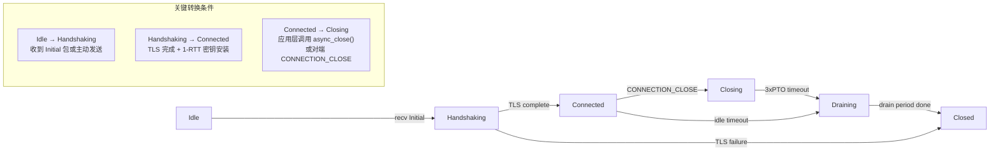

# QUIC 协议实现指南

## 概述

### RFC 9000/9001/9002 规范简述

本实现严格遵循 IETF 标准协议系列：
- **RFC 9000**: QUIC 传输协议核心规范，定义连接管理、流控制、拥塞控制机制
- **RFC 9001**: TLS 作为 QUIC 安全绑定的实现方式，描述密钥推导和握手流程
- **RFC 9002**: QUIC 丢包和拥塞控制标准，定义 NewReno 算法的行为约束

### 与 TCP/TLS 的对比优势

**性能对比**：

```
传统 TCP+TLS 1.2:   ClientHello → ServerHello/Cert → Key Exchange → Application Data
                  (3 RTT + Handshake = ~4 RTT)

QUIC (TLS 1.3):    ClientHello → Certificate+Finish → 0-RTT* → Application Data
                  (1-2 RTT；受控 0-RTT 仅在显式启用且票据可用时发送)
```

**关键优势**：
- **零往返（0-RTT）**：支持受控、显式 opt-in 的 early data；仅允许可安全重放的请求，拒绝后会回退到 1-RTT
- **多路复用**：无队头阻塞，HTTP/3 可在不同流上并发传输
- **连接迁移**：IP 地址/UDP 源端口变更后通过 PATH_CHALLENGE/PATH_RESPONSE 验证并保持连接
- **内建加密**：所有载荷强制 AES-GCM/ChaCha20-Poly1305 保护

### 本实现的架构分层图

```
┌─────────────────────────────────────────┐
│        HTTP/3 Application Layer         │  ← Router, Middleware, Handlers
├─────────────────────────────────────────┤
│        QPACK Encoder/Decoder            │  ← HPACK 静态表实现，动态表待扩展
├─────────────────────────────────────────┤
│          QUIC Stream Transport          │  ← Flow Control, Congestion Ctrl
├─────────────────────────────────────────┤
│        BoringSSL QUIC API Adapter       │  ← SSL_QUIC_METHOD callbacks
├─────────────────────────────────────────┤
│           UDP Socket Wrapper            │  ← Windows IOCP / Linux epoll
└─────────────────────────────────────────┘
```

---

## 核心数据结构详解

### connection_id

**固定容量 small-buffer 设计**：

```cpp
struct connection_id {
    std::array<std::byte, 20> buffer_;  // 最大 20 字节 CID（符合 RFC 限制）
    uint8_t length_ = 0;                 // 实际长度
    
    constexpr size_t length() const noexcept { return length_; }
    const std::byte* data() const noexcept { return buffer_.data(); }
};
```

**为什么不用 vector？**
- **热路径优化**：QUIC 每个包都包含 CID，热点代码必须避免堆分配
- **小对象优化**：20 字节可完全放入 CPU L1 cache line
- **确定性内存**：固定容量保证每次操作 O(1)

**DCID vs SCID 的区别**：

```cpp
// Destination Connection ID - 对端用来识别我们
connection_id dcid_;  // Initial 中携带，由服务端生成
connection_id scid_;  // Source Connection ID，客户端随机生成

// 服务端视角：
// DCID = client_random_cid     (用于识别客户端)
// SCID = server_generated_cid  (用于客户端路由回包)
```

**CID 轮转策略（CID rotation）**：

```cpp
// 每发送 64 个包更换一次 DCID，增加攻击者预测难度
constexpr int kCIDRotationInterval = 64;

void rotate_dcid() {
    auto new_cid = generate_random_cid();
    // 旧 CID 进入 pending 状态，等待 3xPTO 超时后清理
    pending_cid_queue_.push({new_cid, clock::now()});
}
```

### stream_id

**低位比特含义**：

```
Bits [1:0]    Role      Type
0x0           Client    Bidirectional    (0, 4, 8, ...)
0x1           Server    Bidirectional    (2, 6, 10, ...)
0x2           Client    Unidirectional   (1, 5, 9, ...)
0x3           Server    Unidirectional   (3, 7, 11, ...)
```

**流创建顺序协商**：

```cpp
// Client Hello Transport Parameters 中的参数
uint64_t initial_max_stream_ids_bidi_local_;   // 客户端创建的最大的双向流 ID
uint64_t initial_max_stream_ids_bidi_remote_;  // 允许服务端创建的最大双向流 ID
uint64_t initial_max_stream_ids_uni_;          // 单播流上限

// 初始化检查
if (stream_id % 2 == 0 && stream_id > max_client_bidi_) {
    return quic_errc::stream_limit_error;
}
```

**内部流类型映射**：

```cpp
enum class internal_stream_type {
    control,    // 流 0：控制和设置
    datagram,   // HTTP Datagram / WebTransport 使用的 DATAGRAM 扩展（显式协商启用）
    qpack_block,// 流 1 和 2：QPACK 上下行块
};
```

### packet_number

**三个独立空间**：

```cpp
struct packet_number_spaces {
    packet_number init_rx_;   // Initial 接收序列号
    packet_number init_tx_;   // Initial 发送序列号
    
    packet_number hs_rx_;     // Handshake 接收
    packet_number hs_tx_;     // Handshake 发送
    
    packet_number app_rx_;    // Application 接收
    packet_number app_tx_;    // Application 发送
};
```

**编码规则（截断为 1-4 字节）**：

```cpp
// RFC 9000 §17.2：根据前序包号选择最短表示
varint encode_packet_number(packet_number pn, packet_number prev_pn) {
    if (prev_pn < 64) {
        return varint(pn & 0x3f);        // 2 bits
    } else if (prev_pn < 16384) {
        return varint(pn & 0x3fff);      // 4 bits
    } else if (prev_pn < 1073741824) {
        return varint(pn & 0xfffffff);   // 6 bits
    }
    return varint(pn);                     // 8 bits
}
```

**解码恢复算法（RFC 9000 Appendix A）**：

```cpp
packet_number decode_packet_number(uint64_t encoded, size_t length, 
                                   packet_number last_received) {
    uint64_t window_size = 1ULL << (2 * length);
    uint64_t threshold = window_size / 2;
    
    // 高位推断逻辑
    uint64_t candidate = (last_received & 0xffffffff00000000ULL) | encoded;
    
    if (candidate <= last_received && last_received - candidate <= threshold) {
        return packet_number(candidate);
    } else if (candidate > last_received && candidate - last_received < threshold) {
        return packet_number(candidate + window_size);
    } else {
        return packet_number(candidate - window_size);
    }
}
```

**永不重用原则**：

```cpp
// 每次连接周期使用递增 PN，即使重建连接也不会复用 PN 值
static thread_local atomic<uint64_t> global_session_counter_{0};

uint64_t generate_session_key() {
    return ++global_session_counter_;  // 保证全局唯一性
}
```

---

## 状态机流转图



**关键状态转换条件详解**：

### Idle → Handshaking

```cpp
state transition idle_to_handshaking(quic_packet_header& header) {
    if (header.type == initial_packet) {
        // Server 端：生成 Initial SCID，发送 response
        scid_ = random_connection_id();
        send_initial_response();
        
        // Client 端：缓存 Initial ACKs
        pending_ack_[handshake_space_] = header.dest_conn_id;
    }
    
    return {next_state: Handshaking, actions: {start_tls_handshake}};
}
```

### Handshaking → Connected

```cpp
async task handshake_complete() {
    co_await tls_context_->on_write_flight();  // 等待 TLS 写入完成
    
    // 安装 1-RTT 读密钥
    install_read_keys(ssl_quic_read_level(ssl_, application));
    
    // 验证 Transport Parameters 匹配性
    if (!validate_transport_params()) {
        return quic_errc::protocol_violation;
    }
    
    co_return next_state: Connected;
}
```

### Connected → Closing

```cpp
task<void> async_close(error_code code, std::string_view reason) {
    // 构造 CONNECTION_CLOSE frame
    connection_close_frame frame{
        .is_application_error = true,
        .error_code = static_cast<uint64_t>(code),
        .reason_phrase = reason
    };
    
    // 发送至所有未确认的流
    for (auto& stream : active_streams_) {
        stream->shutdown_send();
    }
    
    send_packet(PacketType::OneRTT, std::move(frame));
    set_next_state(Closing);
}
```

---

## 错误码含义对照表

| RFC 代码 | 枚举值 | 含义 | 处理建议 |
|---------|--------|------|---------|
| 0x0 | `no_error` | 正常关闭 | 无需操作，记录日志 |
| 0x1 | `internal_error` | 内部错误 | 记录详细堆栈，清理资源 |
| 0x2 | `connection_refused` | 连接被拒绝 | 客户端触发重连逻辑 |
| 0x3 | `flow_control_error` | 流控超限 | 检查窗口管理逻辑 |
| 0x4 | `frame_encoding_error` | Frame 编码错误 | 验证对端序列号 |
| 0x5 | `stream_state_error` | 流状态异常 | 检查流读写状态 |
| 0x6 | `final_size_error` | 最终大小不一致 | 校验应用层完整性 |
| 0x7 | `frame_error` | 非法帧类型 | 记录 Frame 上下文 |
| 0x8 | `crypto_exchange_error` | TLS 交换失败 | 检查证书链 |
| 0x9 | `transport_parameter_error` | 传输参数错误 | 解析 params JSON |
| 0xA | `protocol_violation` | 协议违规 | 记录详细协议上下文 |
| 0xB | `invalid_token` | Token 无效 | 验证重试令牌 |
| 0xC | `application_error` | 应用层错误 | 传递原因字符串 |
| 0xD | `certificate_required` | 需要证书 | 检查 ALPN/Cert |
| 0xE | `http_3_error` | HTTP/3 协议错误 | RFC 9114 错误码 |
| 0xF | `no_resumption_tickets` | 无恢复票据 | 降级到完整握手 |

**错误码枚举定义**：

```cpp
enum class quic_error_code : uint64_t {
    no_error = 0x0,
    internal_error = 0x1,
    connection_refused = 0x2,
    flow_control_error = 0x3,
    frame_encoding_error = 0x4,
    stream_state_error = 0x5,
    final_size_error = 0x6,
    frame_error = 0x7,
    crypto_exchange_error = 0x8,
    transport_parameter_error = 0x9,
    protocol_violation = 0xA,
    invalid_token = 0xB,
    application_error = 0xC,
    certificate_required = 0xD,
    http_3_error = 0xE,
    no_resumption_tickets = 0xF,
};

// 转换为 RFC 标准格式
uint64_t to_rfc_format(quic_error_code code) {
    // 最高位 2 bit 保留 = 00
    // 剩余 62 bit 为用户错误码
    return static_cast<uint64_t>(code);
}
```

---

## 丢包检测算法详解

### 基于包号阈值（kPacketThreshold=3）

```cpp
constexpr int kPacketThreshold = 3;  // 连续丢失超过 3 个包判定为真丢失

bool is_packet_lost(const rx_packet_info& info) {
    // 如果存在更大的未确认包号，则当前包可能乱序
    for (const auto& ack_range : ack_frames_.ranges_) {
        if (info.pn < ack_range.start && info.pn > ack_range.end) {
            if (ack_range.end - info.pn >= kPacketThreshold) {
                return true;  // 确定丢失
            }
        }
    }
    return false;
}
```

### 基于时间 PTO

**公式**：
\[
PTO = \text{smoothed\_rtt} + \max(4 \times \text{rtt\_var}, \text{granularity}) + \text{max\_ack\_delay}
\]

**实现细节**：

```cpp
struct rtt_stats {
    time_point latest_rtt_;
    duration smoothed_rtt_;
    duration rtt_var_;
    duration min_rtt_;
    duration max_ack_delay_ = ms(25);  // RFC 默认值
};

duration compute_pto() const noexcept {
    constexpr auto granularity = ms(10);
    return smoothed_rtt_ + max(4 * rtt_var_, granularity) + max_ack_delay_;
}
```

**超时重传逻辑**：

```cpp
void on_packet_probing_timeout() {
    auto pto = compute_pto();
    timer_.set_expiry(clock::now() + pto);
    
    // Probe 包发送策略
    for (const auto& unacked : pending_packets_) {
        retransmit_packet(unacked);
    }
}
```

### 三阶段 RTT 采样

**MIN_RTT（最小观测值）**：

```cpp
void update_min_rtt(time_point sample_time) {
    if (min_rtt_ == infinity || sample_time < min_rtt_) {
        min_rtt_ = sample_time;
        // 每次更新后清除其他指标，避免污染
        if (smoothed_rtt_ != infinity) {
            smoothed_rtt_ = infinity;
        }
    }
}
```

**LATEST_RTT（最近一次 RTT）**：

```cpp
time_point latest_rtt_;  // 最新样本，不滤波

void update_latest_rtt(time_point now) {
    // 仅在收到 ACK 时更新
    if (ack_received_) {
        latest_rtt_ = now - send_time_;
    }
}
```

**SMOOTHED_RTT（EWMA 滤波）**：

```cpp
constexpr double kAlpha = 1.0 / 8.0;  // RFC 推荐权重
constexpr double kBeta = 1.0 / 4.0;   // 方差权重

void update_smoothed_rtt(duration new_sample) {
    if (smoothed_rtt_ == infinity) {
        smoothed_rtt_ = new_sample;
        rtt_var_ = new_sample / 2;
    } else {
        // Exponential Weighted Moving Average
        rtt_var_ = (1 - kBeta) * rtt_var_ + kBeta * abs(smoothed_rtt_ - new_sample);
        smoothed_rtt_ = (1 - kAlpha) * smoothed_rtt_ + kAlpha * new_sample;
    }
}
```

---

## 拥塞控制实现细节

### NewReno 状态机

```cpp
enum class cc_state {
    slow_start,       // 慢启动阶段
    congestion_avoidance,  // 避免拥塞阶段
    recovery,         // 恢复阶段
    recovery_recovery,  // 二次恢复（极少见）
};

class newreno_cc : public congestion_controller {
    cc_state state_ = cc_state::slow_start;
    size_t cwnd_ = kInitialCwnd;  // 初始 10 MTU
    size_t ssthresh_ = max_size_t;  // 半衰点
};
```

**状态转换图**：

```
Slow Start ───────→ [cwnd < ssthresh]
    │                    │
    │ cwnd += min(1, num_acked) * MTU
    ▼                    ▼
[cwnd >= ssthresh] → Congestion Avoidance
                       │
                       │ AIMD: cwnd += MTU * MTU / cwnd
                       ▼
                   [3x DUP ACK or Timeout]
                           │
                           ▼
                      Recovery
                           │
                           │ 全窗口数据确认
                           ▼
                 Congestion Avoidance (新 ssthresh)
```

### cwnd 初始值

```cpp
constexpr size_t kMTU = 1500;
constexpr size_t kInitialCwnd = 10 * kMTU;  // 约 14KB

// Slow Start 增长：每个 ACK 增加 cwnd
void on_packets_acked(size_t num_packets) {
    switch (state_) {
        case cc_state::slow_start:
            cwnd_ += min(static_cast<size_t>(1), num_packets) * kMTU;
            if (cwnd_ >= ssthresh_) {
                enter_congestion_avoidance();
            }
            break;
            
        case cc_state::congestion_avoidance:
            // Additive Increase
            cwnd_ += kMTU * kMTU / cwnd_;
            break;
    }
}
```

### ssthresh 计算

```cpp
void enter_recovery(size_t bytes_in_flight) {
    ssthresh_ = max(cwnd_ / 2, 2 * kMTU);  // 至少 2 MTU
    cwnd_ = ssthresh_ + 2 * kMTU;           // Fast Recovery 起始点
    state_ = cc_state::recovery;
}
```

**AIMD 近似公式**：

在拥塞避免阶段，cwnd 随时间的变化率：

\[
\frac{dcwnd}{dt} \approx \frac{MTU^2}{cwnd(t)}
\]

这导致：
- **低负载**：cwnd 快速增长（线性增长）
- **高负载**：cwnd 增长变缓（双曲线衰减）

---

## 已知限制

- ✅ **支持连接迁移（Connection Migration）**  
  收到新 UDP 源地址后执行 Path Validation；验证成功后切换 peer endpoint
  与可用 CID，HTTP/3 流保持在原连接上继续。当前已有 Windows Debug/Release
  源端口切换回归测试。

- ✅ **支持受控 0-RTT early data**  
  客户端必须显式启用并使用可重放安全的方法；服务端需要应用提供票据
  加密与共享 anti-replay cache。拒绝 early data 时幂等请求会安全回退到 1-RTT。

- ✅ **支持 QPACK 动态表**  
  已实现 encoder/decoder 流、动态插入/索引、Required Insert Count 阻塞恢复、
  确认与取消；HTTP/3 客户端默认宣告 64 KiB 动态表。

- ✅ **拥塞控制支持 NewReno、CUBIC 与 BBRv1**  
  `quic_config::congestion_algorithm` 在连接建立时选择算法；默认 NewReno
  保持既有 RFC 9002 行为，CUBIC 适用于长连接和高带宽路径，BBRv1 使用带宽与
  最小 RTT 估计。选择后的控制器状态原位保存，包处理路径不引入锁或堆分配。

**未来路线图**：
- v1.1: QPACK 响应侧动态索引配置与第三方动态表 soak
- v1.2: NAT 重绑定/丢包条件下的迁移压力测试
- v1.3: `draft-ietf-quic-multipath-12` 实验实现。双方显式宣告
  `initial_max_path_id` 后，每条路径都有独立 CID 序列、1-RTT 包号、ACK、RTT、
  丢包恢复、拥塞控制与 pacing；`async_probe_path()` 验证新 endpoint 后，调度器才会
  在可用路径之间传输应用数据，`async_abandon_path()` 会关闭指定路径并回退。默认仍是 RFC 9000 单路径。当前覆盖同一 UDP socket 的
  多远端地址；多本地网卡/多 socket、PMTU 和第三方草案互操作仍是后续工作。

---

*本文档为 cnetmod v1.0-MVP 版本技术文档，最后更新时间：2026-08-03*
